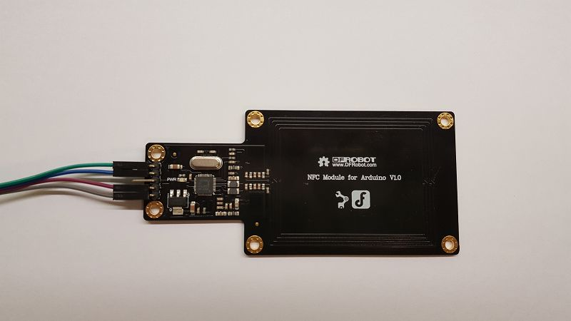
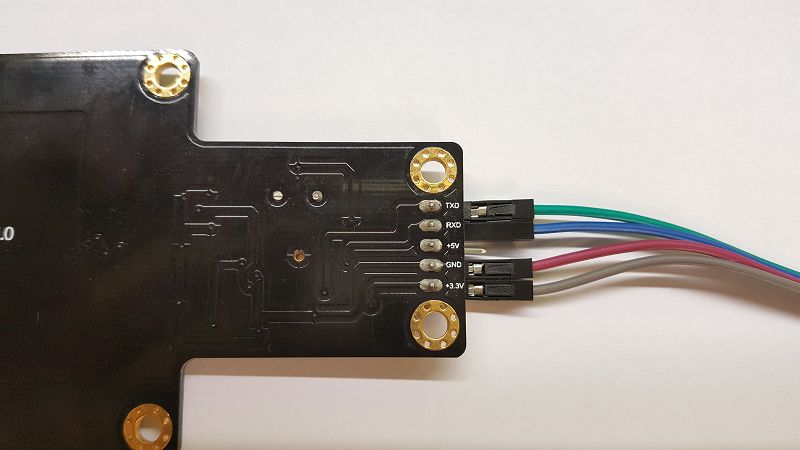
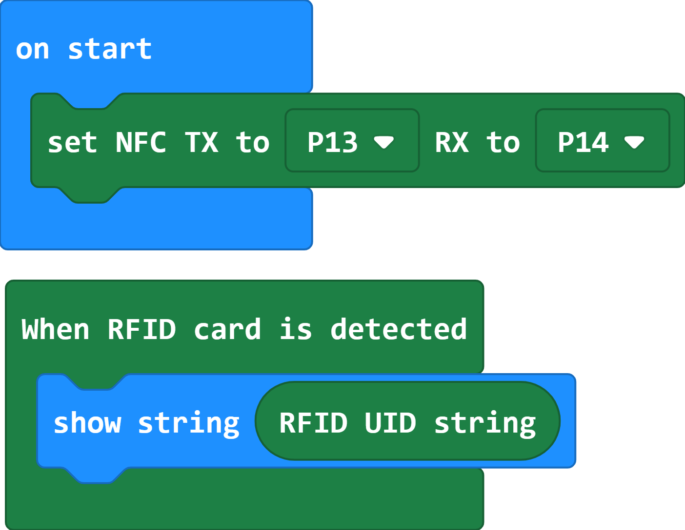
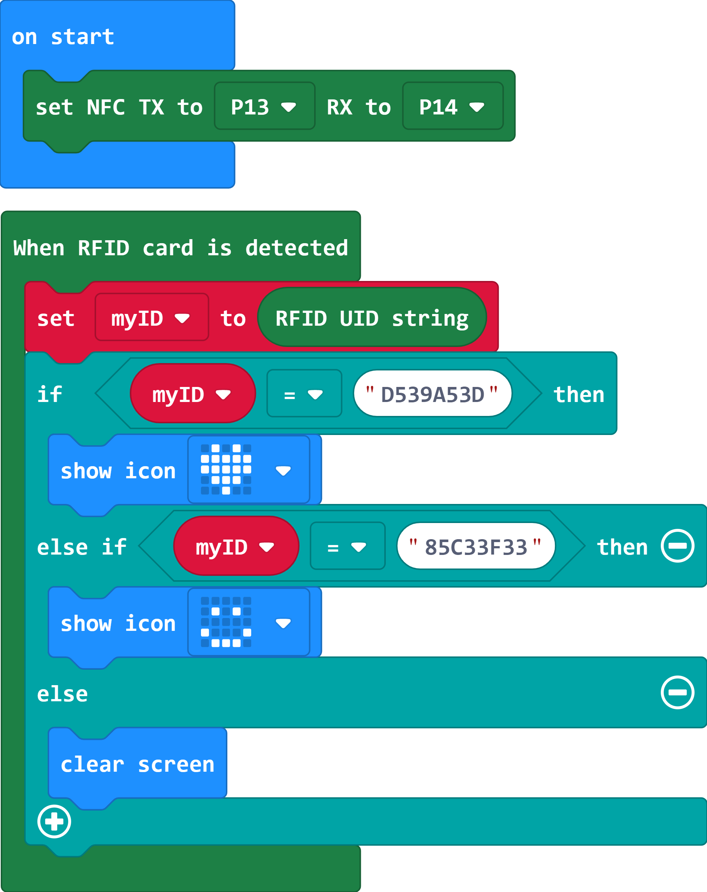

# NFC

這是專為micro:bit提供的NFC積木\
This is the NFC blocks

## Author
Liou Zheng-Ji\
劉正吉\
[my page, https://sites.google.com/jes.mlc.edu.tw/ljj/](https://sites.google.com/jes.mlc.edu.tw/ljj/)

## Description
This extension is for DFRobot "NFC Module for Arduino". It has a UART interface that can be connected to micro:bit.\
\
\

## Example1: How to get uids from every RFID tags.


## Video1: 
[](https://www.youtube.com/watch?v=TLi4DBspejo)

## Example2: How to use the uids to control other things.


## Video2: 
[](https://www.youtube.com/watch?v=NQBP2cRPgTw)

## License

* MIT

## Supported targets

* for PXT/microbit
(The metadata above is needed for package search.)

```package
NFC=github:lioujj/pxt-NFC
```
